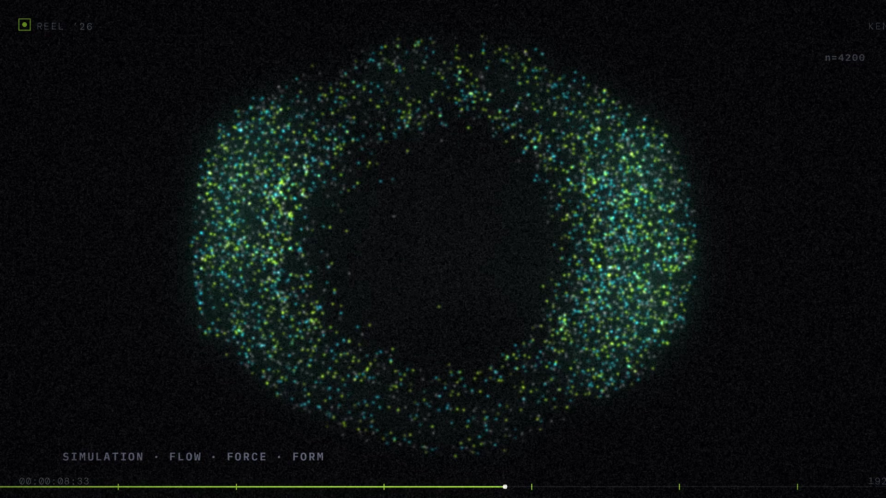
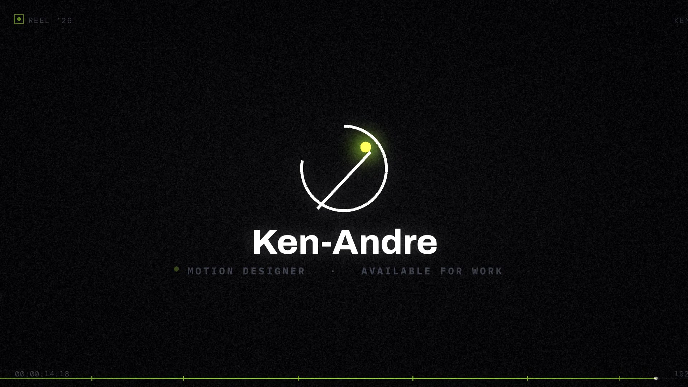

# 🎬 myshowreel — 15 seconds of procedural motion design

> **Showreel '26** · 15.00 s · 1920×1080 @ 60 fps + a 1080×1920 cut · original synthesised score ·
> **zero stock footage, zero templates, zero keyframe software** — every single frame is generated by code.



## ▶️ Watch — autoplays right here, full reel one click away

GitHub's README renderer strips `<video>` tags, so: the previews below **autoplay silently in the
README**, and one click opens the **[watch page](https://ken-andre.github.io/myshowreel/)** — full 1080p60 reel **with the synthesised
score, playing in your browser, nothing to download**.

**[▶ WATCH THE FULL REEL WITH SOUND →](https://ken-andre.github.io/myshowreel/)**

[](https://ken-andre.github.io/myshowreel/)

9:16 cut — preview (click to watch full):

[](https://ken-andre.github.io/myshowreel/)

| file | also grab it as |
|---|---|
| 16:9 master cut | [`videos/showreel_1080p60.mp4`](videos/showreel_1080p60.mp4) |
| 9:16 vertical cut | [`videos/showreel_vertical_1080x1920.mp4`](videos/showreel_vertical_1080x1920.mp4) |
| the score, standalone | [`audio/showreel_score.wav`](audio/showreel_score.wav) |

End card: 

## ✂️ The cut — beat-locked to 120 BPM (downbeat at 1.000 s)
| t | scene | what's happening |
|---|---|---|
| 0.0–2.0 | IGNITION | bezier comet draws at constant arc-speed → morphs into the title rule; "MOTION" slams in per-glyph on damped springs while Archivo's **weight 180→900 & width 66→112 axes animate live** |
| 2.0–4.0 | SYSTEMS | lime bar wipe; dot-grid reveal on a diagonal wave; wireframe cube line-draws in true perspective; live counters |
| 4.0–6.5 | KINETIC | sweeping-bar letter reveal on magenta → scramble-decode with beat-pulse → variable-axis slam (wdth 62→125, wght 100→900, elastic settle) |
| 6.5–9.0 | FLOW | 4 200 particles in a curl-noise field with velocity streaks + streamlines → attract into the word **FLUID** → shockwave → rotating orbit ring |
| 9.0–11.5 | PRODUCT | 5-card 3D carousel (real perspective transforms, depth blur); cursor eases in, clicks → ripple, lime progress, staggered chart |
| 11.5–13.5 | MONTAGE | 12 hard cuts on 8th-notes: RGB split, scan sweeps, starburst, glitched colour bars; slice-displacement glitch + riser |
| 13.5–15.0 | OUTRO | monogram stroke-on, name mask-reveal, blinking availability dot, specular shine sweep, vignette close |

## 🧠 Under the hood
- **Custom compositor** (`source/motion/engine.py`): numpy + OpenCV. Variable-font type engine (per-glyph spring transforms, live axis interpolation), supersampled PIL vector layers, perspective 3D projector, easing library (springs, elastic, cubic-bezier solver).
- **Simulation** (`source/motion/px.py`): divergence-free trig flow field, attractor targets sampled from type masks, shockwaves, velocity-streak splatting with persistent trails.
- **Grade**: bloom, radial chromatic aberration, film grain, vignette, filmic tonemap — then raw RGB is piped straight into x264. No intermediate frames touch disk.
- **Score** (`source/audio.py`): scipy-synthesised drums/bass/plucks/pads, sidechain duck on every kick, sub-impacts on every scene change, bit-crush stutters in the montage.
- **The 9:16 cut is a real recomposition** (`source/motion/vertical.py`), not a letterbox: per-scene dynamic crop (cover vs. contain framing, edge-extended full-bleed colour) plus designed top/bottom type bands carrying a vertical-native HUD.

## 📦 Repo layout
```
videos/      the two cuts (H.264 + AAC)
posters/     thumbnail stills
audio/       the 15 s score, standalone WAV
source/      the whole generator: motion/ engine + scenes + vertical, render.py, audio.py, preview.py
             assets/fonts/  → FONTS.md + fetch_fonts.sh (typefaces are OFL, downloaded not vendored)
SHOWREEL_NOTES.md   full production spec
```

## 🛠️ Render it yourself
```bash
pip install numpy opencv-python-headless pillow scipy
cd source
./assets/fonts/fetch_fonts.sh
python3 audio.py                                   # writes the score
REEL_NAME="Your Name" REEL_ROLE="MOTION DESIGNER" \
  python3 render.py --audio out/audio.wav --final out/my_reel.mp4
python3 render.py --vertical --audio out/audio.wav --final out/my_reel_vertical.mp4
```
Swap the name, swap the role, re-render — the end card and HUD pick them up automatically.

## 🔤 Typefaces
Archivo (variable), Anton, Archivo Black, Space Grotesk, Syne, IBM Plex Mono, DM Mono, Bebas Neue — all SIL OFL / Apache, via [`source/assets/fonts/FONTS.md`](source/assets/fonts/FONTS.md).

---
Built by **Ken-Andre** · Douala 🇨🇲 · passionate about engaging user experiences — let's collaborate and build something awesome!
Source is here to learn from and remix for your own reel. The videos themselves are my personal showreel — please don't repost them as your own work.
